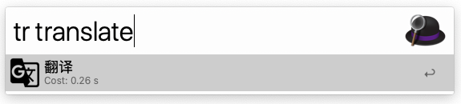
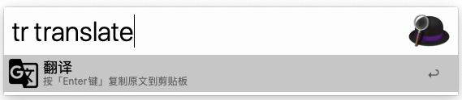

# MyTranslate workflow
An alfred workflow that can automatically translate text.

Support the translation of Chinese into English and other languages into Chinese.

## Translate (tr)

Use Google Translate to translate the entered text.

**Keyword: tr**

## Copy the original text to Clipboard (⌥ + ⏎)

Press ⌥ + ⏎ to copy the original text to the clipboard.

## Copy translation results to Clipboard (⌘ + ⏎)

Press ⌘ + ⏎ to copy the translation result to the clipboard.

## License

